# Классификация ударов в боксе с помощью сверточных и рекуррентных нейросетей

## Введение

Задача автоматического распознавания действий в видеопотоке привлекает внимание исследователей в области технического зрения с 1980-х годов [Kautz, 1980].
Развитие возможностей вычислительных машин позволило применить алгоритмы в различных приложениях, таких как медицина, взаимодействие человека и компьютера или спорте.
В боевых искуствах для распознавания действий используется множество различных техник.
Известен подход классификации ударов с помощью акселерометров и сверточных нейронных сетей [Khasanshin, 2021].

Постановка задачи распознавания действий включает в себя классификацию и присвоение метки каждому из последовательности 2D-кадров, где действие может выполняться или не выполняться на протяжении всей продолжительности видео. 

X -> F -> Y
X - множество кадров видеопотока
F - извлекаемые признаки из 2D изображения
Y - множество классов действий.

Это кажется естественным расширением задач классификации изображений на несколько кадров с последующим агрегированием прогнозов из каждого кадра. 
Несмотря на стремительный успех архитектур глубокого обучения в классификации изображений (ImageNet), прогресс в архитектурах для классификации видео и обучения представлениям был более медленным.
Решение задачи извлечения ключевых точек в режиме реального времени стала возможна с появлением архитектуры MoveNet [Bajpai 2021].

## Метод исследования

Распознавание действий осуществляется в два этапа:
1. Выделение ключевых точек с помощью MoveNet.
2. Покадровая классификация с помощью сверточной или рекурентной нейросети.

### Описание MoveNet

MoveNet - это быстрая и точная модель, которая выделяет 17 ключевых точек тела. 
Обучение проводилось на двух датасетах: COCO и внутреннем наборе данных Google под названием Active.
Модель предлагается на TF Hub в двух вариантах, известных как Lightning и Thunder. 
Lightning предназначен для приложений, критичных к задержке, в то время как Thunder предназначен для приложений, требующих высокой точности. 
Обе модели работают в реальном времени (>30 fps) на современных телефонах, что имеет решающее значение для практической реализации.
Архитектура представлена на рисунке.  

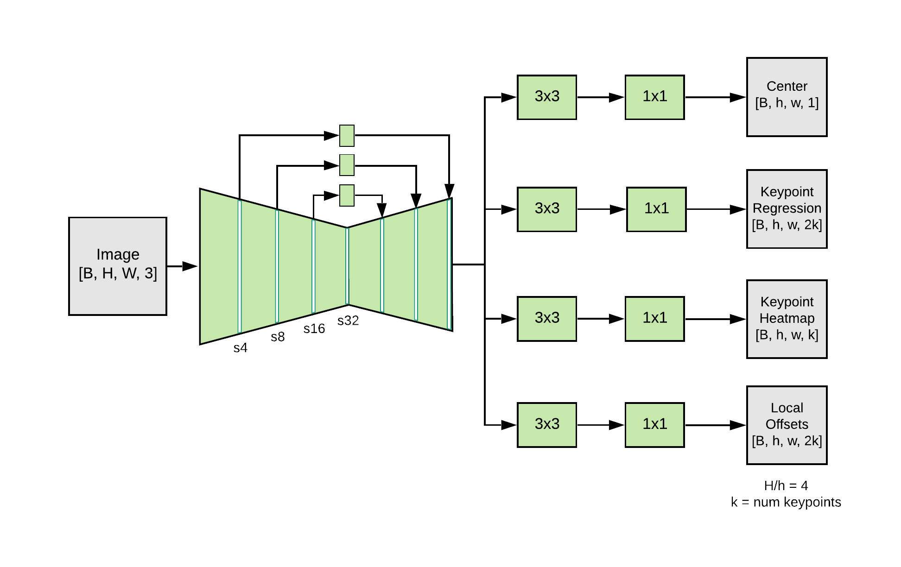

Модель способна выделять ключевые точки при условии, что в кадре находится один человек.
Однако для приложения классификации ударов это ограничение является несущественным.

17 ключевых точек, выделенные MoveNet являются исходной информацией для построения дополнительных признаков.

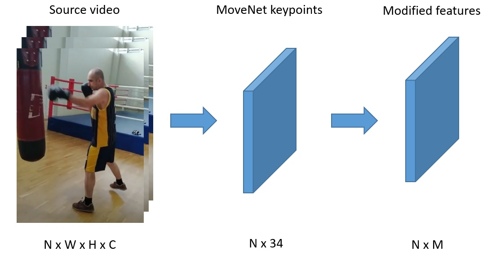

Координаты ключевых точек нормализуются относительно центральной точки на теле человека.
За начало координат принимается точка, расположенная между правым и левым бедром.

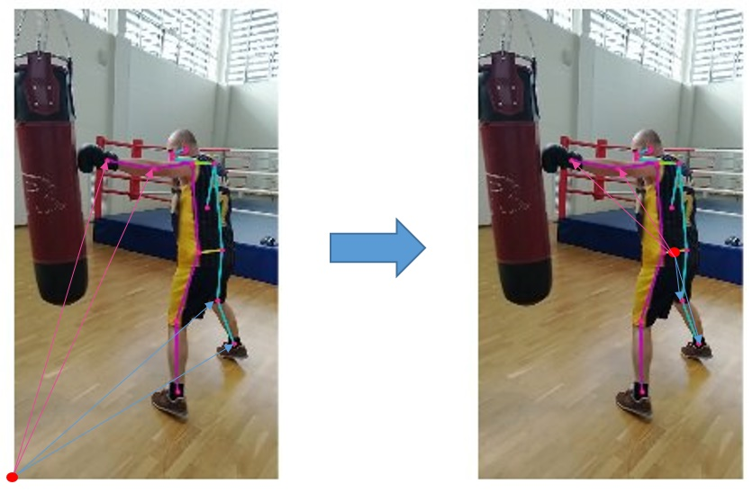

### Описание рекуррентной модели

Вдоль оси времени выбирается окно из 30 векторов признаков, которое подается на вход рекуррентной нейросети.
Для каждого отсчета делается предсказание класса удара, соответствующему кадру.
Итого на выходе имеется 30 отсчетов.
Обучение нейросети проходит на размеченных вручных данных - каждому кадру ставится в соответствие номер класса удара.

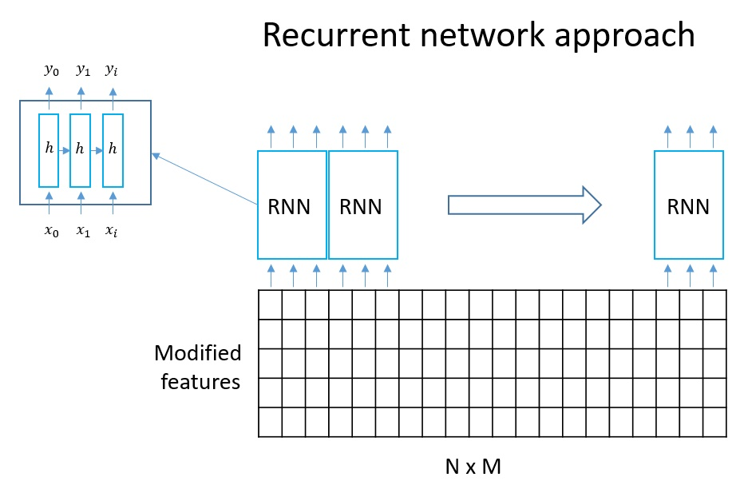

### Описание сверточной модели

Вдоль оси времени выбирается окно из 10 векторов признаков, которое подается на вход сверточной нейросети.
Количество сверточных фильтров выбирается по количеству классов ударов. 
Сверточное окно двигается вдоль оси времени.
На выходе вектор из 13 значений, соответствующих корреляции с соответствующим окном.
В качестве предсказанного класса берется argmax.

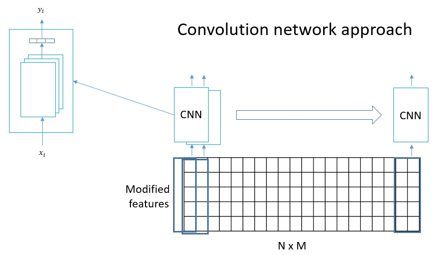

## Результаты экспериментов (7 классов)

Проведен эксперимент с условиями:
- reversed data - включена в обучающую выборку,
- нормализация координат относительно средней точки (тоже включена в признаки)
- GRU в качестве рекуррентной модели,
- двухлойный персептрон на выходе,
- поиск гиперпараметров с помощью генетического алгоритма (keras tuner).  

Код эксперимента - GRU-Normalized-Stream.ipynb  
Результат эксперимента  

| train_loss | train_accuracy | val_loss | val_accuracy |
|------------|----------------|----------|--------------|
| 0.5908     | 0.8400         | 0.9813   | 0.7337       |

Процесс обучения представлен на рисунке. 

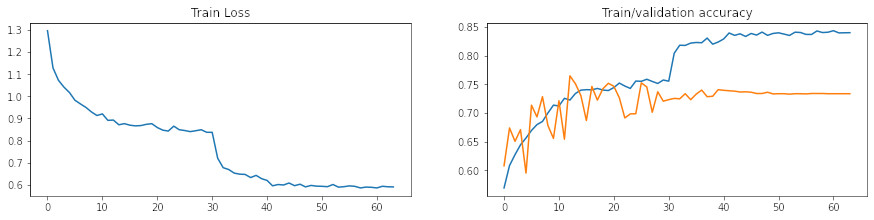

Проведен эксперимент с условиями:
- reversed data - включена в обучающую выборку,
- нормализация координат относительно средней точки (тоже включена в признаки)
- два сверточных слоя Conv2D и Conv1D для извлечения признаков,
- двухлойный персептрон на выходе,
- поиск гиперпараметров с помощью генетического алгоритма (keras tuner).  

Код эксперимента - CNN-Normalized-Stream.ipynb  
Результат эксперимента  

| train_loss | train_accuracy | val_loss | val_accuracy |
|------------|----------------|----------|--------------|
| 0.3409     | 0.8773         | 0.8483   | 0.7184       |

Процесс обучения представлен на рисунке. 

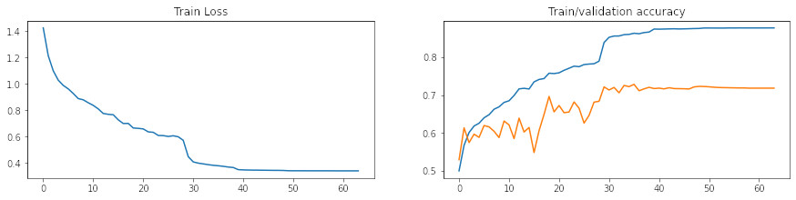

### Результаты экспериментов (13 классов)

Проведен эксперимент с условиями:
- нормализация координат относительно средней точки (средняя точка не включена в признаки)
- RNN в качестве рекуррентной модели,
- 13 классов.  

Код эксперимента - RNN-LSTM-GRU-CNN.ipynb (ветка rnn_lstm_cnn_simple)

Архитектура модели

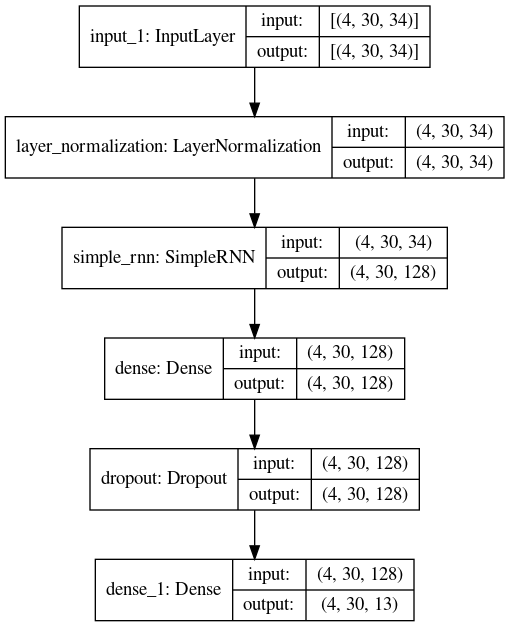

Результат эксперимента  

| train_loss | train_accuracy | val_loss | val_accuracy |
|------------|----------------|----------|--------------|
| 1.5621     | 0.5230         | 1.6014   | 0.4971       |

Процесс обучения представлен на следующем изображении

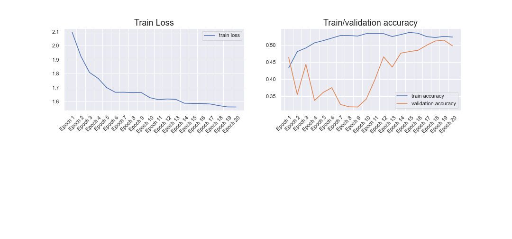

Проведен эксперимент с условиями:
- нормализация координат относительно средней точки (средняя точка не включена в признаки)
- LSTM в качестве рекуррентной модели,
- 13 классов.  

Код эксперимента - RNN-LSTM-GRU-CNN.ipynb (ветка rnn_lstm_cnn_simple)

Архитектура модели

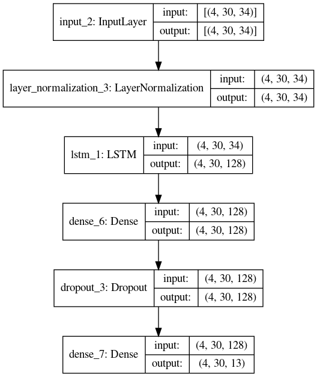

Результат эксперимента

| train_loss | train_accuracy | val_loss | val_accuracy |
|------------|----------------|----------|--------------|
| 0.7216     | 0.7827         | 1.4962   | 0.6112       |

Процесс обучения представлен на следующем изображении

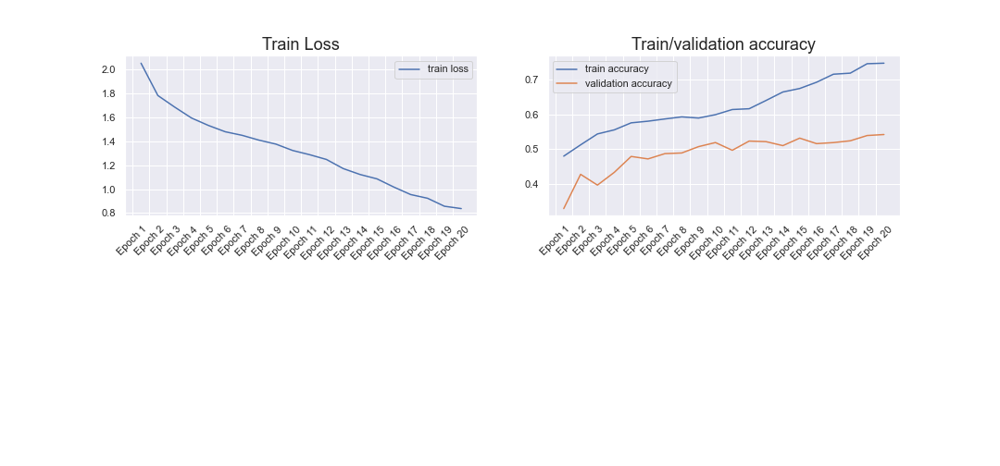

Проведен эксперимент с условиями:
- нормализация координат относительно средней точки (средняя точка не включена в признаки)
- GRU в качестве рекуррентной модели,
- 13 классов.  

Код эксперимента - RNN-LSTM-GRU-CNN.ipynb (ветка rnn_lstm_cnn_simple)

Архитектура модели

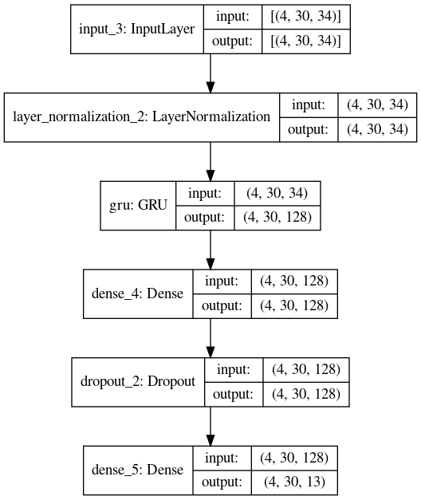

Результат эксперимента

| train_loss | train_accuracy | val_loss | val_accuracy |
|------------|----------------|----------|--------------|
| 0.8379     | 0.7473         |  1.4761  | 0.5418       |

Процесс обучения представлен на следующем изображении

Проведен эксперимент с условиями:
- использование сверточной сети вместо рекуррентной,
- нормализация координат относительно средней точки (средняя точка не включена в признаки),
- 13 классов.  

Код эксперимента - RNN-LSTM-GRU-CNN.ipynb (ветка rnn_lstm_cnn_simple)

Архитектура модели

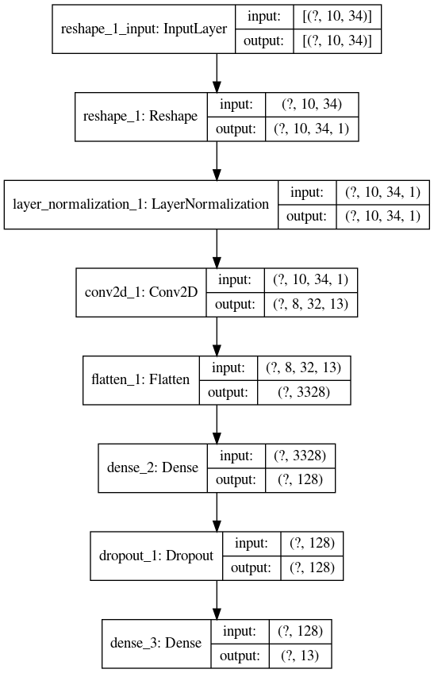

Результат эксперимента

loss:  - accuracy:  - val_loss:  - val_accuracy: 

| train_loss | train_accuracy | val_loss | val_accuracy |
|------------|----------------|----------|--------------|
| 0.8872     | 0.7511         |  5.5739  | 0.3965       |

Процесс обучения представлен на следующем изображении

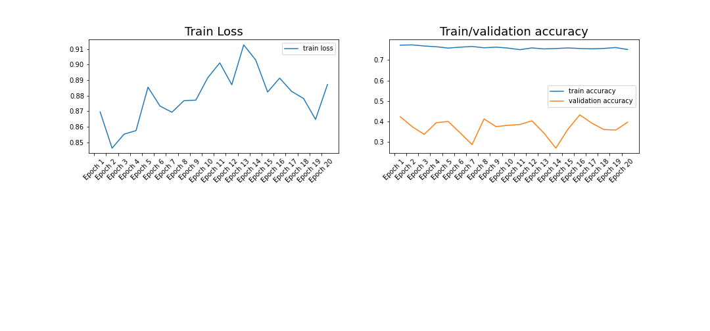

### Основной эксперимент №2 (ветка train_lstm__exp2)

Проведен эксперимент с условиями:
- использование lstm сети,
- нормализация координат относительно средней точки (средняя точка не включена в признаки),
- 34 ключевые точки + углы между предплечьем и плечом,
- поиск гиперпараметров с помощью генетического алгоритма (keras tuner),
- 13 классов.  

Код эксперимента - train_lstm_model.ipynb

Архитектура модели

- входные данные размерности (4, 30, 36)
- 1 lstm слой (128 units)
- 2 полносвязных слоя (224 и 13 units)
- каждый слой сопровождается нормализацией
- для предотвращения переобучения используются слои Dropout и регуляризация L2

Результат эксперимента

| train_loss | train_accuracy   | val_loss | val_accuracy   |
|------------|------------------|----------|----------------|
| 0.7760     | 0.8137           |  1.7347  | 0.6199         |

Процесс обучения представлен на следующем изображении

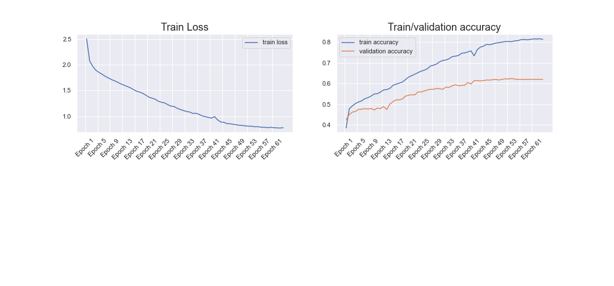

## Заключение

Низкая точность моделей обусловлена недостаточным количеством информации о движении ключевых точек бойца.
Дополнительная информация может быть извлечена из других источников, например наручных браслетах.
Использование алгоритмов комплексирования результатов оптических измерений и ускорений возможно позволит строить более точные оценки о силе и качестве ударов. 

## Список источников

R. Bajpai and D. Joshi, "MoveNet: A Deep Neural Network for Joint Profile Prediction Across Variable Walking Speeds and Slopes," in IEEE Transactions on Instrumentation and Measurement, vol. 70, pp. 1-11, 2021, Art no. 2508511, doi: 10.1109/TIM.2021.3073720.  

Broilovskiy A., Makarov I. (2021) Human Action Recognition for Boxing Training Simulator. In: van der Aalst W.M.P. et al. (eds) Analysis of Images, Social Networks and Texts. AIST 2020. Lecture Notes in Computer Science, vol 12602. Springer, Cham. https://doi.org/10.1007/978-3-030-72610-2_25

## Добавить

- [ ] Введение: добавить несколько примеров из https://github.com/jinwchoi/awesome-action-recognition
- [ ] Введение: добавить ссылки на статьи по MoveNet